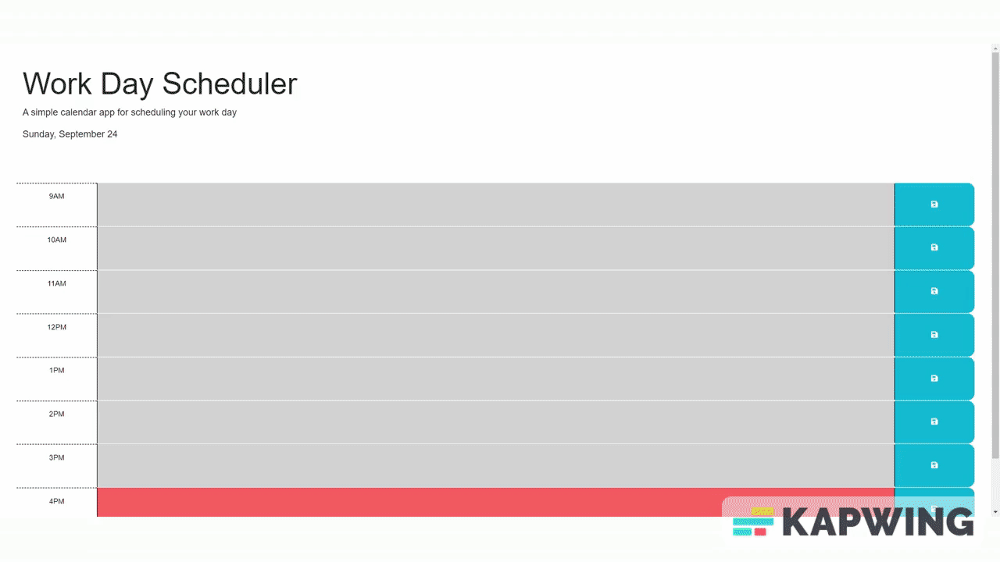

# Work_Day_Scheduler

## Description

This project is designed for 9 - 5 workers. Workers may utilize this scheduler to input events into each hour segment, inputs are saved and will reappear when the user refreshes the page. When an hour has past the time slot turns gray, current hour displays as red, and future hours display as green.

## Installation

N/A

## Usage

You can find the project here: https://trlivenp.github.io/Work-Day-Scheduler/

## Credits

Starter code provided by Rutgers Full stack bootcamp -  found here: https://github.com/coding-boot-camp/crispy-octo-meme

## License
MIT License

Please refer to the LICENSE file within this repo for more information.

## Features

Save buttons

LocalStorage saving inputted text

Colors for each hour based off of past,future,present